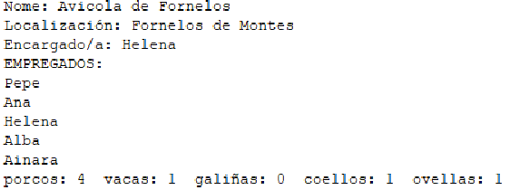

# Ejercicio 1 (POO)

Neste exercicio terás que modelar unha granxa, para iso, deberás crear as seguintes clases e métodos
(e establecer as relacións entre elas que consideres oportuno):

## Un enumerado chamado TipoAnimal que pode tomar os valores: 
porcos, vacas, galiñas, coellos ou ovellas.
<br><br>


## Unha interface Gandeiro cos seguintes métodos que non toman nin devolven valores:
+ alimentarAnimais()
- limparCortes()
<br><br>


## Unha clase Empregado (da que non se poden crear obxectos directamente) cos seguintes atributos:
+ numEmpregado: un número enteiro co número de empregado. Este número
deberá ser maior que 0.
* nome: unha cadea co nome do empregado.
- dataInicio: a data na que comezou a traballar na granxa. Debe
comprobarse que sexa anterior á data actual, se non o é poñerase no seu lugar a
data de hoxe.
+ salarioBase: o salario base que cobra mensualmente. Non poderá ser
menor que o SMI (1000€).
* Un construtor con todos os parámetros.

<h4> E os seguintes métodos:</h4>

- determinarSalarioReal(): Devolverá o salario real mensual do
empregado. O salario real será o salario base máis 30€ por cada trienio completo
na granxa (3 anos completos desde que empezou a traballar na granxa).
Podes empregar a clase Period e os seus métodos between() e getYears() para
facer este cálculo.
- Getters e setters.
<br><br>


## Unha clase PersoalServizos, filla de Empregado cos seguintes atributos:

+ posto: que será un carácter que poderá tomar os valores R (recepción) ou C
(contabilidade). O seu valor por defecto será R.
<br>
<br>


## Unha clase CoidadorAnimais, filla de Empregado e que será tamén Gandeiro, que terá os seguintes atributos:

+ tipoAnimalExperto: co tipo de animais nos que é experto este
empregado. Debe utilizarse o enumerado TipoAnimal indicado anteriormente.
O salario real dun coidador calcularase coma o dun empregado xenérico pero engadiráselle
un extra de 10€ ao mes se é experto en porcos ou 5€ se é experto en vacas (os outros expertos
non teñen un extra).
<br>
Implementará os métodos da interface Gandeiro de modo que amosen unha mensaxe por
pantalla indicando a que tipo de animais se está alimentando ou limpando as cortes (este tipo
de animais será o indicado polo seu tipoAnimalExperto).
<br>
<br>


## Unha clase Granxa cos seguintes atributos:
+ nome: o nome da granxa
* localización: a vila na que está situada a granxa.
- encargado: obxecto de tipo Empregado que indica que empregado é o
encargado da granxa.
+ empregados: é un ArrayList coas persoas que traballan na granxa.
* numAnimais: é un array que almacena o número de animais que hai na
granxa. Na posición 0 os porcos; na 1, as vacas; na 2, as galiñas; na 3, os coellos e na
4, as ovellas.

<h4> A clase disporá dos seguintes construtores:</h4>

- Un que recibe o nome, localización e encargado. 
* O ArrayList cos empregados inicialízase baleiro e o array co número de animais inicialízase a 0 en todas as súas posicións.
+ Outro que recibe todos os atributos.

<h4> E dos seguintes métodos:</h4>

- Getters para todos os atributos.
* Setters para o nome, localización e encargado.
+ engadirAnimal(TipoAnimal t) engade un animal dese tipo,
incrementando o seu número na posición do array numAnimais correspondente.
* engadirEmpregado(Empregado e) recibe un empregado e o engade ao
ArrayList.
- getNumeroAnimais() devolve o número total de animais que hai na
granxa.
+ getNumeroEmpregados(boolean coidadores) devolve o número de
empregados da granxa. Se coidadores é true, devolve unicamente o número de
coidadores de animais.
* toString() que amosará os datos da granxa da seguinte maneira:




## A clase co método main xa se facilita no ficheiro POO.java. Crea todos os outros ficheiros para que funcione sen modificacións.

```java
CoidadorAnimais c1 = new CoidadorAnimais(1, "Pepe", LocalDate.of(2002, Month.MARCH, 2), 1500, TipoAnimal.porcos);
        CoidadorAnimais c2 = new CoidadorAnimais(2, "Ana", LocalDate.of(2020, Month.SEPTEMBER, 3), 1400, TipoAnimal.galiñas);
        CoidadorAnimais c3 = new CoidadorAnimais(3, "Helena", LocalDate.of(2019, Month.OCTOBER, 4), 1700, TipoAnimal.vacas);
        PersoalServizos p1 = new PersoalServizos(5, "Alba", LocalDate.of(2021, Month.JANUARY, 5), 1550, 'R');
        PersoalServizos p2 = new PersoalServizos(6, "Ainara", LocalDate.of(2017, Month.FEBRUARY, 6), 1550, 'C');

        Granxa g = new Granxa("Avicola de Fornelos", "Fornelos de Montes", c3);
        g.engadirEmpregado(c1);
        g.engadirEmpregado(c2);
        g.engadirEmpregado(c3);
        g.engadirEmpregado(p1);
        g.engadirEmpregado(p2);
        g.engadirAnimal(TipoAnimal.vacas);
        g.engadirAnimal(TipoAnimal.porcos);
        g.engadirAnimal(TipoAnimal.porcos);
        g.engadirAnimal(TipoAnimal.porcos);
        g.engadirAnimal(TipoAnimal.porcos);
        g.engadirAnimal(TipoAnimal.coellos);
        g.engadirAnimal(TipoAnimal.ovellas);

        System.out.println(g);

        for (Empregado e : g.getEmpregados()) {
            System.out.println(e.getNome() + " cobra " + e.determinarSalarioReal());
        }
```
